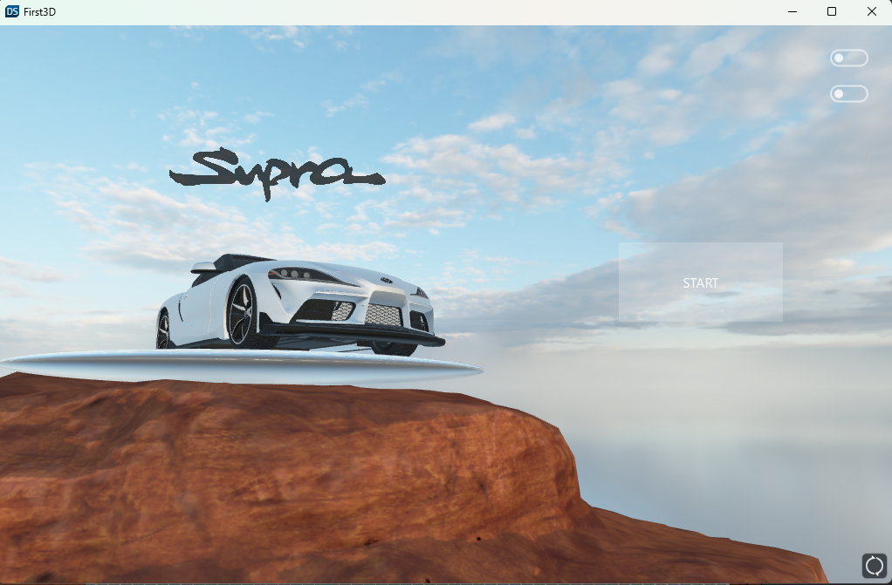

# 3DCarShow Qt DesignStudio/QML - by Krzuch

3D project made in Qt DesignStudio/QML.

Project made by myself using Qt DesignStudio/QML.

### Authors: 

Krzysztof N (https://github.com/KrzucH)

## Application video:

https://www.youtube.com/watch?v=kSn_TcshpHE&ab_channel=SBMLabel

## Pictures

